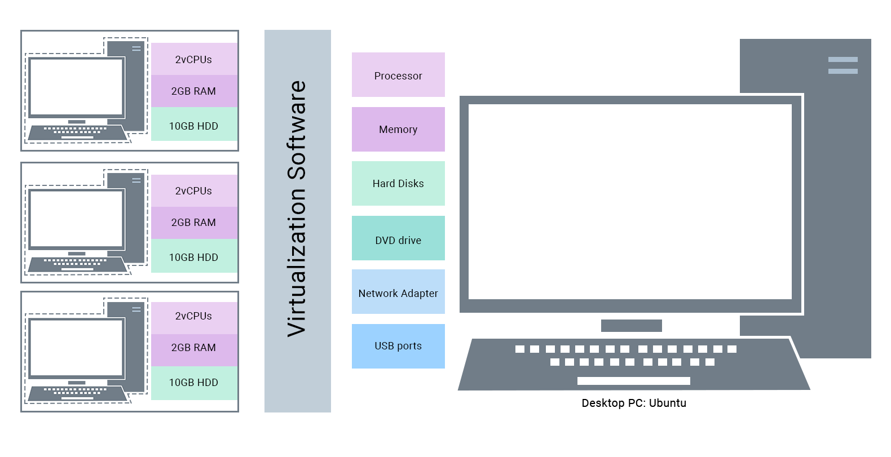

# Наша крутая тема урока
## Хекслет, hexlet.io

---
layout: center
background: center
---

# План

* Сначала сделаем первое
* Потом сделаем второе
* Ну и третье наверное надо
* А потом как четвертое произойдет, ухх

---
background: center
layout: center
---

# Просто слайд
## с умной мыслью в центре

---
background: center
layout: center
---

# Просто слайд

с умной мыслью в центре, она не такая умная и короткая, как на первом слайде, но более интересная и большая, как на этом

А после можно расположить список, например:

* Сначала сделаем первое
* Потом сделаем второе

---
background: center
layout: center
---

# Уже более интересный слайд с кликами

<v-clicks>

* Клик, и появилось это
* А потом вот это
* Ну и куда уж без этого?
* Магия какая-то, да? Прям как руби-дуриловка

</v-clicks>

---
background: common
---

# Просто слайд с примером кода

<div class="code-text-xl">

```dockerfile
WORKDIR /root/hexlet-basics

COPY package.json .
COPY yarn.lock .
RUN yarn install

COPY Gemfile .
COPY Gemfile.lock .
RUN bundle install --jobs $(nproc)

COPY . .

RUN NODE_ENV=production bin/rails assets:precompile
```

</div>


---
background: common
---

# Тот же код, но с крутым выделением кода при кликах

<div class="code-text-xl">
```dockerfile {all|3-5|11}
WORKDIR /root/hexlet-basics

COPY package.json .
COPY yarn.lock .
RUN yarn install

COPY Gemfile .
COPY Gemfile.lock .
RUN bundle install --jobs $(nproc)

COPY . .

RUN NODE_ENV=production bin/rails assets:precompile
```
</div>

---
background: common
---

# Еще более интересное выделение

<div class="code-text-xl">

```yml {all|3,4,8|3,4,8,13,14|5,9|6,7|11,12|10}
version: '3'

services:
  db: # Имя сервиса одновременно является dns именем
    image: postgres:13.3 # Используется готовый образ
    environment: # Беспарольный доступ
      POSTGRES_HOST_AUTH_METHOD: trust
  web:
    build: . # По умолчанию использует Dockerfile
    command: npm run dev # Старт сервера
    volumes:
      - .:/app # /app – рабочая директория внутри
    depends_on:
      - db # Зависит от базы данных
```
</div>

---
background: 'common'
layout: two-cols-right-full
---

# Слайд с разделением на 2 полосы

* первый пункт
* второй пункт
* третий пункт
* и финальный пункт

::right::

```shell
# Процесс работы без Docker Compose

# Для связи контейнеров нужно создавать общую сеть
docker network create hexlet-basics

# Ручная сборка

# Быстрая сборка без установки зависимостей и приложения во внутрь
docker build -f Dockerfile.development -t hexlet

# Запускается как демон, чтобы не мешать работе с другими
docker run -d -rm \
  --name hexlet-postgres \
  --network hexlet-development \
  -e POSTGRES_PASSWORD=mysecretpassword \
  -e PGDATA=/var/lib/postgresql/data/pgdata \
  -v /custom/mount:/var/lib/postgresql/data \
  postgres

```

---
background: 'common'
---
<!-- Просто картинка -->



---
background: common
---

# Навигация (ну и пример с таблицей)

Hover on the bottom-left corner to see the navigation's controls panel

### Keyboard Shortcuts

|     |     |
| --- | --- |
| <kbd>space</kbd> / <kbd>tab</kbd> / <kbd>right</kbd> | next animation or slide |
| <kbd>left</kbd>  / <kbd>shift</kbd><kbd>space</kbd> | previous animation or slide |
| <kbd>up</kbd> | previous slide |
| <kbd>down</kbd> | next slide |

---
background: common
layout: center
---

# Больше раскладок и примеров на сайте sli.dev
## https://sli.dev/guide/syntax.html

<!-- Последний слайд всегда оставляем `hexlet-next` -->
---
layout: hexlet-next
---
